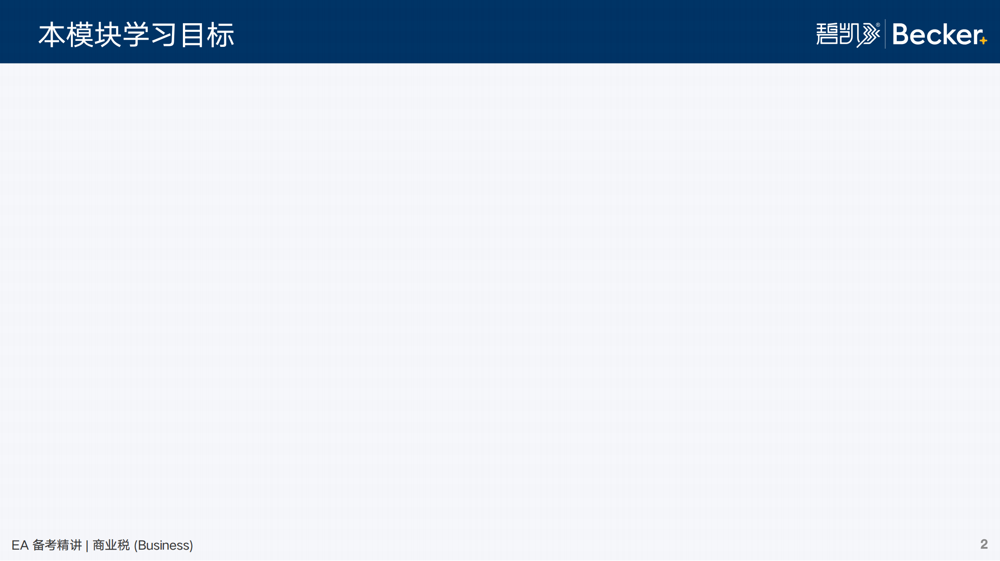

# EA Layout Rules

EA 课程 PPT 专属布局规则与版式定义。

## 标准模板参考

下图是 EA 课程 PPT 内容页的**标准模板**，所有内容页布局**必须完全遵循**此模板的尺寸、位置和样式规范：



## Page Types

### Cover Slide (封面页)

```
┌─────────────────────────────────────┐
│                          [Logo]     │
│                                     │
│           [课程标题]                 │
│           [副标题]                   │
│                                     │
│  [讲师图标] 主讲老师：[name]          │
└─────────────────────────────────────┘
```

**元素位置**:
- Logo: 右上角 (`./assets/becker-logo.png`)
- 标题: 居中
- 副标题: 标题下方居中
- 讲师信息: 左下角（讲师图标 + 文字）

**适用场景**: 每个 PPT 的第一页

---

### Content Slide (内容页) ⚠️ 必须严格遵循

**内容页是使用频率最高的版式，必须严格按照参考图规范执行：**

```
┌─────────────────────────────────────┐
│ ═════════════════════════════════  │  ← 顶部蓝色装饰条
│  [页面标题]              [Becker]   │  ← 标题 + Logo（白色文字，在蓝色条内）
│                                     │
│                                     │
│  [主要内容区域]                      │  ← 内容边距：上下左右各 20px
│                                     │
│                                     │
│                                     │
│  EA 备考精讲 | [科目]              2 │  ← 页脚（左：课程名，右：页码）
└─────────────────────────────────────┘
```

**精确规格规范**:

| 元素 | 规格 |
|------|------|
| **顶部蓝色装饰条** | 颜色：`#1a3a5c`，高度：页面高度的 8-10%（约 40-50px），宽度：全宽 |
| **页面标题** | 字体：Source Han Sans Bold，字号：24-28pt，颜色：`#ffffff`，位置：距左边 20px，垂直居中于蓝色条 |
| **Logo** | 路径：`./assets/becker-logo.png`，位置：右上角，距右边 20px，垂直居中于蓝色条 |
| **内容区域上边距** | 蓝色条底部至内容顶部：40px |
| **内容区域下边距** | 内容底部至页脚顶部：60px |
| **内容区域左右边距** | 各 20px |
| **页脚左侧** | 文字："EA 备考精讲 | [科目名称]"，字体：Source Han Sans Regular，字号：12-14pt，颜色：`#333333` |
| **页脚右侧** | 页码，字体：Source Han Sans Regular，字号：12-14pt，颜色：`#333333`，距右边 20px |
| **页脚垂直位置** | 距页面底部 20px |

**适用场景**: 所有正文内容页，无例外

---

### Closing Slide (结束页)

```
┌─────────────────────────────────────┐
│                                     │
│                                     │
│              谢谢                    │
│       Becker 碧凯学习中心            │
│                                     │
│                                     │
│  [讲师图标] 主讲老师：[name]          │
└─────────────────────────────────────┘
```

**元素位置**:
- 感谢语: 居中
- 机构名称: 感谢语下方居中
- 讲师信息: 底部（讲师图标 + 文字）

**适用场景**: 每个 PPT 的最后一页

---

## 递归组合式布局系统 (Recursive Compositional Layout System)

内容页采用**容器嵌套**的组合式布局设计，通过有限的基础元素递归组合，实现无限丰富的页面结构。

### 核心概念

布局系统分为两个层次：
- **Container（容器）**: 负责空间分割，可以无限嵌套
- **Content（内容）**: 实际的内容元素，是递归的终点

---

## Container Types（容器类型）

### HStack - 水平分栏容器

**作用**: 将内部空间横向分割为多个区域

**参数**: 各区域的宽度比例

**常用比例**:
- 双栏: `[50%, 50%]`, `[40%, 60%]`, `[60%, 40%]`, `[30%, 70%]`
- 三栏: `[33%, 34%, 33%]`, `[25%, 50%, 25%]`

**子元素**: 可以是任何容器或内容类型

**示意图**:
```
┌─────────────────────────────────────┐
│  [标题]                      [Logo] │
│─────────────────────────────────────│
│                                     │
│   [区域1]    │    [区域2]           │
│              │                      │
│                                     │
└─────────────────────────────────────┘
```

---

### VStack - 垂直分栏容器

**作用**: 将内部空间纵向分割为多个区域

**参数**: 各区域的高度比例

**常用比例**:
- 上下均分: `[50%, 50%]`
- 上重下轻: `[60%, 40%]`, `[70%, 30%]`
- 上轻下重: `[30%, 70%]`, `[40%, 60%]`

**子元素**: 可以是任何容器或内容类型

**示意图**:
```
┌─────────────────────────────────────┐
│  [标题]                      [Logo] │
│─────────────────────────────────────│
│                                     │
│          [区域1]                    │
│─────────────────────────────────────│
│          [区域2]                    │
│                                     │
└─────────────────────────────────────┘
```

---

## Content Types（内容类型）

以下是可以放入容器的基础内容元素：

### BulletList - 项目列表
- 使用 `•` 作为项目符号
- 适用于并列要点、特征罗列
- 建议每页 3-6 个项目

### NumberedList - 编号列表
- 使用 `1. 2. 3.` 作为编号
- 适用于步骤说明、优先级排序
- 建议每页 3-6 个项目

### Text - 文字段落
- 普通段落文字
- 适用于概念解释、详细说明
- 建议控制在 3-5 行内

### Chart - 图表
- 各类数据可视化图表
- 柱状图、饼图、折线图、流程图等
- 应占据足够空间以保证可读性

### Table - 表格
- 结构化数据展示
- 建议列数不超过 5 列
- 复杂表格考虑使用全幅布局

### Image - 图片
- 插图、照片、截图
- 应保持适当的宽高比
- 避免过度拉伸变形

### KeyPoints - 要点卡片
- 带编号的高亮框，用于强调核心概念
- 适用于 2-4 个关键要点
- 可横向排列展示

```
┌─────┐  ┌─────┐  ┌─────┐
│ 1   │  │ 2   │  │ 3   │
│要点 │  │要点 │  │要点 │
└─────┘  └─────┘  └─────┘
```

### Quote - 引用框
- 引用他人观点或重要结论
- 需标注出处
- 使用引用样式（如左侧竖线）

---

## 组合规则与语法

### 基本语法

使用类似 YAML 的缩进结构描述布局嵌套关系：

```yaml
容器类型: [比例参数]
  - 子元素1
  - 子元素2
    - 如果子元素也是容器，可继续嵌套
```

### 嵌套规则

1. **容器可以无限嵌套**: HStack 内可以有 VStack，VStack 内可以有 HStack
2. **内容是叶子节点**: Content 类型不能再包含子元素
3. **比例总和应为 100%**: 容器内各区域比例之和应接近 100%
4. **保持平衡**: 避免过深的嵌套层级（建议不超过 3 层）

---

## 典型场景示例

### 场景 1: 单栏纯列表

**适用**: 3-5 个要点、纯文字内容

```yaml
BulletList
```

```
┌─────────────────────────────────────┐
│  [标题]                      [Logo] │
│─────────────────────────────────────│
│                                     │
│  • 要点 1                           │
│  • 要点 2                           │
│  • 要点 3                           │
│                                     │
└─────────────────────────────────────┘
```

---

### 场景 2: 左文右图双栏

**适用**: 概念解释 + 示意图

```yaml
HStack: [60%, 40%]
  - BulletList
  - Image
```

```
┌─────────────────────────────────────┐
│  [标题]                      [Logo] │
│─────────────────────────────────────│
│                                     │
│  • 要点 1         │   [图片]        │
│  • 要点 2         │                 │
│  • 要点 3         │                 │
│                                     │
└─────────────────────────────────────┘
```

---

### 场景 3: 左列表，右侧上图下文

**适用**: 要点说明 + 数据图表 + 补充文字

```yaml
HStack: [40%, 60%]
  - BulletList
  - VStack: [60%, 40%]
      - Chart
      - Text
```

```
┌─────────────────────────────────────┐
│  [标题]                      [Logo] │
│─────────────────────────────────────│
│                │                    │
│  • 要点 1      │    [图表]          │
│  • 要点 2      │                    │
│  • 要点 3      │────────────────────│
│                │  补充说明文字       │
│                │                    │
└─────────────────────────────────────┘
```

---

### 场景 4: 三栏要点卡片

**适用**: 3 个核心概念并列展示

```yaml
KeyPoints  # 特殊的三栏布局内容类型
```

```
┌─────────────────────────────────────┐
│  [标题]                      [Logo] │
│─────────────────────────────────────│
│                                     │
│  ┌─────┐  ┌─────┐  ┌─────┐         │
│  │ 1   │  │ 2   │  │ 3   │         │
│  │要点 │  │要点 │  │要点 │         │
│  └─────┘  └─────┘  └─────┘         │
│                                     │
└─────────────────────────────────────┘
```

---

### 场景 5: 复杂三区域组合

**适用**: 左侧框架、中间详解、右侧要点

```yaml
HStack: [30%, 40%, 30%]
  - BulletList
  - VStack: [50%, 50%]
      - Chart
      - Text
  - NumberedList
```

```
┌─────────────────────────────────────┐
│  [标题]                      [Logo] │
│─────────────────────────────────────│
│           │          │              │
│  • 框架1  │ [图表]   │  1. 步骤1   │
│  • 框架2  │          │  2. 步骤2   │
│  • 框架3  │──────────│  3. 步骤3   │
│           │  详细说明 │             │
│           │          │              │
└─────────────────────────────────────┘
```

---

### 场景 6: 全幅图表

**适用**: 复杂表格、大型流程图

```yaml
Chart  # 或 Table
```

```
┌─────────────────────────────────────┐
│  [标题]                      [Logo] │
│─────────────────────────────────────│
│                                     │
│         [图表/表格 占满]             │
│                                     │
│                                     │
└─────────────────────────────────────┘
```


## Layout Tips - 布局设计原则

### 组合式思维

**从内容出发，而非模板**:
- 不要先选择"双栏布局"或"三栏布局"
- 而是问：这些内容之间是什么关系？如何组织最清晰？
- 然后用容器嵌套自然表达这种关系

**组合的力量**:
- 简单场景用简单结构（单一内容类型，无需容器）
- 复杂场景通过嵌套实现（HStack 包 VStack，VStack 包 HStack）
- 避免为了"看起来复杂"而过度嵌套

### 图表/表格布局原则

**优先使用并列布局**:
- 图表与说明文字应**并列展示**（HStack），而非上下堆叠
- 推荐比例：`[40%, 60%]` 或 `[60%, 40%]`（文字在左或右）
- 只有当图表需要最大化展示时才使用全幅布局

**禁止单栏垂直堆叠**:
```
❌ 错误示范
VStack: [40%, 60%]
  - Text
  - Chart

✅ 正确做法
HStack: [40%, 60%]
  - Text
  - Chart
```

### 内容与结构匹配原则

**容器必须有实际内容支撑**:
- 如果只有 1 个要点列表 → 直接用 `BulletList`，无需容器
- 如果有 2 个独立区域 → 用 `HStack: [比例1, 比例2]`
- 如果有 3 个独立区域 → 用 `HStack: [比例1, 比例2, 比例3]`
- 永远不要创建空区域或占位符

**多个项目的处理**:
- 3-6 个项目：使用单一 BulletList 或 NumberedList
- 2-4 个核心概念：使用 KeyPoints（自带横向排列）
- 7+ 个项目：考虑分页或使用 Table

**引用的正确使用**:
- Quote 类型仅用于**真实引用**（必须有出处）
- 如果只是想强调某段话，使用 Text 配合加粗样式

### 比例选择指南

**HStack 常用比例**:
- `[50%, 50%]`: 两个内容同等重要
- `[60%, 40%]` 或 `[40%, 60%]`: 主次分明
- `[70%, 30%]`: 一主一辅（如长文字 + 小图）
- `[33%, 34%, 33%]`: 三个内容同等重要

**VStack 常用比例**:
- `[50%, 50%]`: 上下均分
- `[60%, 40%]`: 上重下轻（如图表 + 说明）
- `[30%, 70%]`: 上轻下重（如标题 + 主体）

### 嵌套层级控制

**建议最多 3 层嵌套**:
```
✅ 合理的嵌套
HStack: [40%, 60%]          # 第1层
  - BulletList
  - VStack: [50%, 50%]      # 第2层
      - Chart
      - Text

⚠️ 过度嵌套（避免）
HStack: [33%, 34%, 33%]     # 第1层
  - VStack: [50%, 50%]      # 第2层
      - HStack: [50%, 50%]  # 第3层
          - Text
          - Image
  - Chart
  - BulletList
```

**过度嵌套时考虑**:
- 是否可以拆分为多页？
- 是否可以简化内容结构？
- 是否真的需要这么复杂的布局？

---

## Assets

| 资源 | 路径 | 用途 |
|------|------|------|
| Becker Logo | `./assets/becker-logo.png` | 所有页面右上角 |
| 讲师图标 | (待定) | 封面页和内容页 |
